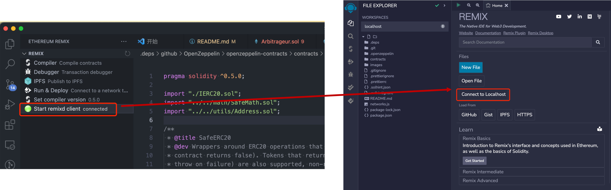
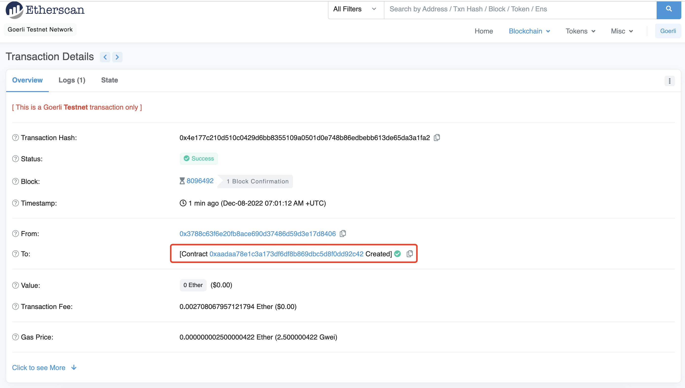

<!-- PROJECT LOGO -->
<br />
<p align="center">
  <a href="#Program-Basics-Flash-Loan">
    
  </a>
  <h3 align="center">DeFi 201 - Lets hack Flash Loans</h3>
  <p align="center">
    Freeze time/space with Flash Loans
    <br />
    <a href="https://docs.aave.com/developers/tutorials/performing-a-flash-loan"><strong>Explore the AAVE dev Flash Loans docs »</strong></a>
    <br />
  <a href="https://brrr.money/">
    
  </a>

<br />
    <a href="#contact">Contact us</a>
    ·
    <a href="https://github.com/Robsonsjre/FlashloanUsecases/issues">Report Bug</a>
    ·
    <a href="https://github.com/Robsonsjre/FlashloanUsecases/issues">Request Feature</a>
    .
    <a href="https://academy.moralis.io/courses/defi-201">Defi 201 课程 </a>  
  </p>
</p>

## [Defi 模拟器](https://furucombo.app/)  

<!-- TABLE OF CONTENTS -->
## Table of Contents
* [Program Basics Flash Loan](#Program-Basics-Flash-Loan)
* [Program a Arbitrage Flash Loan](#Program-Basics-Flash-Loan)
* [Create your own Arbitrage opportunity](#Program-Basics-Flash-Loan)
* [Useful links](#Useful-links)
* [DeFi === Financial Revolution](#Program-Basics-Flash-Loan)
* [Contact](#Program-Basics-Flash-Loan)
* [Acknowledgements](#Program-Basics-Flash-Loan)

<!-- Program Basics Flash Loan -->
# Program Basics Flash Loan
Let's start with the basics the goal is for you to initiate a Flash Loan Transnaction from the AAVE Kovan Test pool.<br>
* Setup Remix http://remix.ethereum.org/
* Get some Goerli Test Net ETH https://goerlifaucet.com/
* Get some AAVE Test Net tokens https://testnet.aave.com/faucet 
* GoTo--> [contracts/sample/flashloan.sol](contracts/sample/flashloan.sol) 
* Load the contract in Remix and deploy the contract
* Fill all paramenters as explaind in the video
* Exicute the Flash loan (Be Sure to have enouge DAI to pay the FEES)
* If there are any questions, issues or future requests please submit an issue

[![Product Name Screen Shot][product-screenshot]](https://github.com/ymm135/FlashloanUsecases/blob/master/contracts/sample/flashloan.sol)

# Program a Arbitrage Flash Loan
* Setup Remix http://remix.ethereum.org/
* Get some Goerli Test Net ETH https://goerlifaucet.com/
* Get some AAVE Test Net tokens https://testnet.aave.com/faucet 
* GoTo--> [contracts/arbitrage/Arbitrageur.sol](contracts/arbitrage/Arbitrageur.sol)
* Load the contract in Remix and deploy the contract
* Fill all paramenters as explaind in the video
* GoTo <a href="https://kovan-uniswap.netlify.app/swap">Uniswap V1</a> & <a href="https://kovan-uniswap2.netlify.app/swap">Uniswap V2</a> and see if you can find an arbitrage operunity
* Exicute the Arbitrage Flash loan (Be Sure to have enouge DAI to pay the FEES)
* If there are any questions, issues or future requests please submit an issue

[![uniswap arbitrage defi201]](https://github.com/Robsonsjre/FlashloanUsecases/tree/master/contracts/arbitrage)

# Create your own Arbitrage opportunity
* Setup Remix http://remix.ethereum.org/
* Get some Kovan Test Net ETH https://faucet.kovan.network/
* Get some AAVE Test Net tokens https://testnet.aave.com/faucet 
* GoTo--> <a href="https://github.com/Robsonsjre/FlashloanUsecases/tree/master/contracts/arbitrage">contracts/arbitrage/arbitrage.sol</a> 
* Load the contract in Remix and deploy the contract
* Fill all paramenters as explaind in the video
* GoTo <a href="https://kovan-uniswap.netlify.app/swap">Uniswap V1</a> & <a href="https://kovan-uniswap2.netlify.app/swap">Uniswap V2</a> and add your token with both diffrent prices
* Exicute the Arbitrage Flash loan (Be Sure to have enouge DAI to pay the FEES)
* If there are any questions, issues or future requests please submit an issue

[![create your own arbitrage opportunity]](https://github.com/Robsonsjre/FlashloanUsecases/tree/master/contracts/arbitrage)

# Useful links
Here are useful links
* [Remix](https://remix.ethereum.org/)
* [Performing a Flash Loan AAVE Dev docs](https://docs.aave.com/developers/v/1.0/tutorials/performing-a-flash-loan)
* [AAVE Markets](https://docs.aave.com/developers/v/1.0/deployed-contracts/deployed-contract-instances)
* [ETH Kovan Faucet](https://faucet.kovan.network/)
* [AAVE Kovan Faucet](https://testnet.aave.com/faucet)
* [AAVE Kovan Pool address](https://kovan.etherscan.io/address/0x95d1189ed88b380e319df73ff00e479fcc4cfa45)
* [Kovan DAI address](https://kovan.etherscan.io/address/0xFf795577d9AC8bD7D90Ee22b6C1703490b6512FD)
* [My Coding Journey: Beginner to Pro](https://forum.openzeppelin.com/t/my-coding-journey-beginner-to-pro/2390)
* [A Graphical Guide for Understanding Uniswap](https://docs.ethhub.io/guides/graphical-guide-for-understanding-uniswap/)
* [Understand Uniswap Exchange in under 10 Minutes](https://www.youtube.com/watch?v=rlkizdfY0vo)
* [Uniswap Whitepaper](https://hackmd.io/@Uniswap/HJ9jLsfTz#%F0%9F%A6%84-Uniswap-Whitepaper)


<!-- DeFi === Financial Revolution -->
# DeFi === Financial Revolution
[![DeFi === Financial Revolution]](https://academy.ivanontech.com/a/27786/UHnVvoMT)

<!-- CONTACT -->
## Contact

Amadeo Brands - [@amadeobrands](https://twitter.com/amadeobrands) - amadeeo@eoi.digital<br>
Guilherme Viana - [@ggviana](https://twitter.com/ggviana) - guilherme@pods.finance<br>
Robson Silva - [@robsjr](https://twitter.com/robsjr) - rob@pods.finance<br>

<strong>See more DeFi resources@ [ON-->DeFi](https://transform.eoi.digital/on-defi/)
</stong><br>
<strong>See the Full DeFi 201 course and many more courses @[The Ivan On Tech Academy](https://academy.ivanontech.com/a/17936/UHnVvoMT)<br>

[![banner][banner]](https://academy.ivanontech.com/a/27786/UHnVvoMT)

<!-- ACKNOWLEDGEMENTS -->
## Acknowledgements
* [AAVE](https://aave.com/)
* [Ivan On Tech Academy](https://academy.ivanontech.com/a/27786/UHnVvoMT)
* [EOI Digital](https://www.eoi.digital/)
* [Pods Finance](https://pods.finance/)
* [Uniswap](https://uniswap.org/)
* [Ethereum](https://ethereum.org/)
* [Hacking, Distributed](https://hackingdistributed.com/2020/03/11/flash-loans/)

<!-- MARKDOWN LINKS & IMAGES -->
<!-- https://www.markdownguide.org/basic-syntax/#reference-style-links -->
[product-screenshot]: images/flashloan.png
[banner]: images/defi-201-banner.png
[dollar-trump]: images/dollar-trump-defi201.png
[DeFi === Financial Revolution]: images/financial-revolution-DeFi201.png
[create your own arbitrage opportunity]: images/create-your-own-arbitrage-opportunity.png
[uniswap arbitrage defi201]: images/uniswap-arbitrage-defi201.png

# 疑问拓展
## Remix 远程连接本地项目  

<br>
<div align=center>
  </img>
</div>


## 套利的交易  
user: `0x3788C63f6E20FB8acE690d37486d59D3e17d8406`
tx: `0x4e177c210d510c0429d6bb8355109a0501d0e748b86edbebb613de65da3a1fa2`

contract: `0xaadaa78e1c3a173df6df8b869dbc5d8f0dd92c42`

合约地址:  
<br>
<div align=center>
  </img>
</div>

视频参数:


## Defi 
DeFi 的用途  
点对点（P2P）金融交易是 DeFi 背后的核心前提之一。P2P DeFi 交易是指两方同意在没有第三方参与的情况下用加密货币交换商品或服务。

在 DeFi 中，P2P 可以满足个人的贷款需求，算法会匹配同意贷方条款的同行，并发放贷款。P2P 支付通过去中心化应用程序或 dApp 进行，并遵循区块链中的相同流程。  

## 代码解读
### Program Basics Flash Loan

```js
  function executeOperation(
    address _reserve,       // 账号地址 
    uint256 _amount,        // 数量
    uint256 _fee,           // 小费
    bytes calldata _params
  ) external {
    // INSERT YOUR USE CASE HERE

    uint256 totalDebt = _amount.add(_fee);
    transferFundsBackToPoolInternal(_reserve, totalDebt);
  }
```

https://github.com/mrdavey/ez-flashloan/blob/remix/contracts/aave/FlashLoanReceiverBase.sol 中的 `transferFundsBackToPoolInternal`
```js
    function transferFundsBackToPoolInternal(address _reserve, uint256 _amount) internal {
        address payable core = addressesProvider.getLendingPoolCore();
        transferInternal(core, _reserve, _amount);
    }
```
